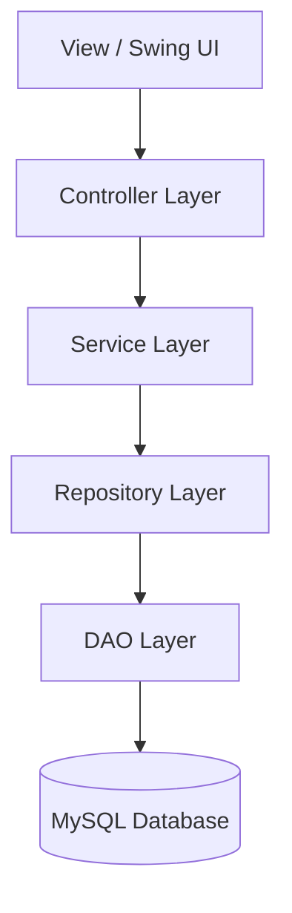
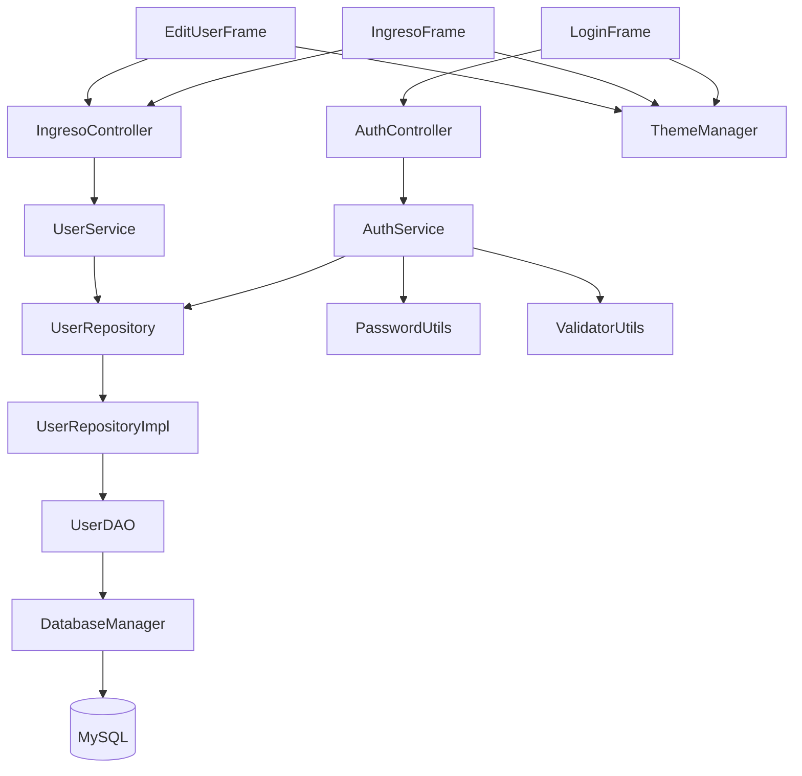

# SecureAuth Desktop - Arquitectura y Guía Técnica

## Descripción General

SecureAuth Desktop es una aplicación de escritorio desarrollada en Java con Swing, orientada a autenticación segura de usuarios y administración empresarial básica.

El proyecto está construido bajo una arquitectura desacoplada y escalable utilizando:

- MVC
- Service Layer
- Repository Pattern
- DAO Pattern
- Maven
- BCrypt
- MySQL

El objetivo principal es construir una aplicación profesional, mantenible y preparada para evolucionar hacia un entorno enterprise.

---

# 1. Arquitectura General

## Arquitectura Aplicada

El sistema implementa una arquitectura multicapa:



---

# 2. Arquitectura Enterprise del Proyecto



---

# 3. Componentes del Sistema

## View (UI)

### Responsabilidad

Encargada de mostrar interfaces gráficas y capturar eventos del usuario.

### Clases principales

- `LoginFrame`
- `IngresoFrame`
- `EditUserFrame`

### Reglas importantes

- NO ejecutar SQL directamente
- NO implementar reglas de negocio
- Mantener enfoque visual y de interacción

---

## Controller

### Responsabilidad

Coordinar la comunicación entre la UI y la lógica del sistema.

### Clases principales

- `AuthController`
- `IngresoController`

### Funciones

- Recibir eventos desde la UI
- Delegar lógica al Service
- Controlar navegación entre pantallas

---

## Service Layer

### Responsabilidad

Implementar reglas de negocio y casos de uso del sistema.

### Clases principales

- `AuthService`
- `UserService`

### Funciones

- Validaciones
- Reglas de autenticación
- Procesamiento de usuarios
- Seguridad
- Normalización de datos

### Ejemplos

- Validación de email
- Validación de contraseña
- Login seguro
- Registro seguro
- Hashing BCrypt

---

## Repository Layer

### Responsabilidad

Desacoplar la lógica de negocio del acceso real a datos.

### Clases

- `UserRepository`
- `UserRepositoryImpl`

### Beneficios

- Reduce acoplamiento
- Facilita testing
- Permite cambiar el motor de base de datos

---

## DAO Layer

### Responsabilidad

Manejo SQL concreto y mapeo de datos.

### Clase principal

- `UserDAO`

### Funciones

- Consultas SQL
- Inserciones
- Actualizaciones
- Eliminaciones
- Conversión `ResultSet -> User`

### Regla importante

NO implementar lógica de negocio aquí.

---

## Model

### Responsabilidad

Representar entidades del dominio.

### Clase principal

- `User`

---

# 4. Flujo Principal del Sistema

## Flujo General

```text
UI -> Controller -> Service -> Repository -> DAO -> MySQL
```

---

# 5. Casos de Uso Implementados

## Registro Seguro

### Flujo

1. UI captura datos
2. `AuthController` recibe información
3. `AuthService.register(user)` procesa datos
4. Validaciones:
   - email
   - password
   - duplicados
5. BCrypt genera hash
6. Repository/DAO almacena usuario
7. Datos guardados en MySQL

---

## Login Seguro

### Flujo

1. Usuario ingresa credenciales
2. `AuthController` delega autenticación
3. `AuthService.login(email, password)`
4. Se busca usuario
5. BCrypt verifica hash
6. Se autentica usuario
7. UI abre dashboard principal

---

# 6. Seguridad Aplicada

## BCrypt

El sistema utiliza:

```text
org.mindrot:jbcrypt
```

### Beneficios

- Hash irreversible
- Salt automático
- Protección contra fuerza bruta
- Coste computacional configurable

---

## PreparedStatement

Toda consulta SQL debe utilizar:

```java
PreparedStatement
```

### Beneficios

- Reduce riesgo SQL Injection
- Mejor manejo de parámetros
- Mayor seguridad

---

# 7. Sistema Visual Centralizado

## Objetivo

Evitar duplicación visual y mantener consistencia gráfica.

---

## Ubicación

```text
secureauth.utils
```

---

## Responsabilidades

- Colores globales
- Tipografías
- Bordes
- Estilos
- Componentes reutilizables
- Configuración visual

---

## Beneficios

- Fácil mantenimiento
- UI consistente
- Evita hardcoding
- Escalabilidad visual
- Soporte futuro para temas

---

# 8. Organización Recomendada de Utils

## Problema actual

Un único package `utils` puede crecer demasiado y volverse difícil de mantener.

---

## Estructura recomendada

```text
secureauth.utils.ui
secureauth.utils.validation
secureauth.utils.security
secureauth.utils.database
```

---

# 9. Problemas Detectados y Mejoras Aplicadas

## Problema 1: UI acoplada al DAO

### Antes

La UI utilizaba `UserDAO` directamente.

### Solución

Se implementó:

```text
UI -> Controller -> Service -> Repository
```

---

## Problema 2: Inconsistencia en tabla de usuarios

### Antes

La tabla recibía más columnas que las definidas.

### Solución

Se normalizó:

```text
ID
NOMBRE COMPLETO
EMAIL
GENERO
ACCION
```

---

## Problema 3: Validación contradictoria de password

### Antes

El tooltip decía "opcional", pero la validación obligaba contraseña.

### Solución

Password ahora es opcional en edición.

Solo se valida longitud mínima si se proporciona.

---

# 10. Problema Actual en Autenticación

## Estado actual

Existe un problema relacionado con autenticación usando BCrypt.

---

## Posibles causas

- Comparación incorrecta de hash
- Uso incorrecto de `BCrypt.checkpw()`
- Diferencias entre password ingresado y almacenado
- Problemas en flujo Controller -> Service
- Datos persistidos inconsistentes

---

## Estado

Actualmente en revisión y refactorización.

---

# 11. Librerías Utilizadas

## Seguridad

```text
org.mindrot:jbcrypt
```

---

## Persistencia

```text
com.mysql:mysql-connector-j
```

---

## Testing

```text
JUnit 5
Mockito
```

---

## Build

```text
Maven
```

---

# 12. Estructura Maven

```text
src/main/java
src/main/resources
src/test/java
```

---

# 13. Recursos

## Ubicación

```text
src/main/resources
```

---

## Contenido

- Iconos
- Imágenes
- Tipografías
- Configuración
- Assets UI

---

# 14. Buenas Prácticas Aplicadas

- MVC
- SOLID
- Clean Code
- Repository Pattern
- DAO Pattern
- Service Layer Pattern
- Separación de responsabilidades
- Reutilización de componentes
- Seguridad centralizada
- Validaciones desacopladas
- Recursos centralizados
- Modularización

---

# 15. Conceptos Técnicos para Defensa

## Hashing != Cifrado

El hashing no puede revertirse.

---

## BCrypt

Utiliza:

- Salt automático
- Coste computacional
- Protección contra ataques de fuerza bruta

---

## Separación de capas

Reduce:

- deuda técnica
- acoplamiento
- complejidad

Y mejora:

- mantenibilidad
- pruebas
- escalabilidad

---

# 16. Evolución Recomendada del Proyecto

## Etapa actual

- Login seguro
- Registro seguro
- Arquitectura multicapa
- BCrypt
- Repository Pattern

---

## Siguiente etapa

- Unit Testing
- Mockito
- Exceptions centralizadas
- DTOs
- SessionManager
- ThemeManager
- AuditLogger

---

## Etapa enterprise

- HikariCP
- Auditoría de login
- Bloqueo por intentos fallidos
- Logs centralizados
- Configuración externa
- Roles y permisos
- JWT o sesiones seguras

---

# 17. Estructura Recomendada de Documentación

```text
docs/
│
├── ARQUITECTURA_SECUREAUTH.md
├── MVC.md
├── SEGURIDAD.md
├── FLUJO_AUTENTICACION.md
├── UI_SYSTEM.md
```

---

# 18. Objetivo Final del Proyecto

Convertir SecureAuth Desktop en una aplicación profesional con:

- Arquitectura limpia
- Seguridad sólida
- Escalabilidad
- UI moderna
- Componentes reutilizables
- Buenas prácticas enterprise
- Fácil mantenimiento
- Código desacoplado